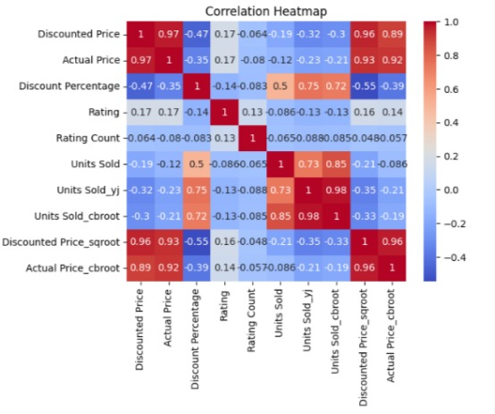
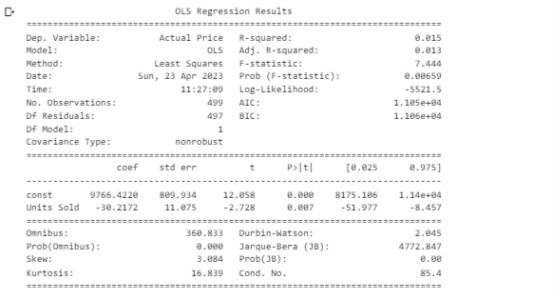
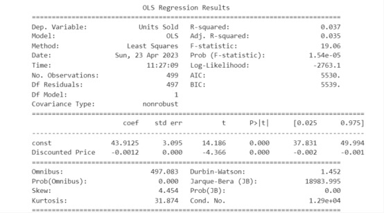
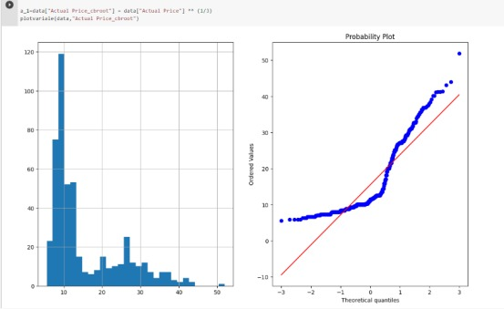

# Amazon-Sales-EDA

**Project Title:** Amazon Sales EDA

**Project Description:**

The case study that was selected  based on the Kaggle dataset for Amazon sales, which contains information about the purchases of various items made through Amazon. Amazon is a well-known e-commerce company that provides a wide range of products and services to customers.Amazon has a global presence and operates in various markets, including North America, Europe, Asia-Pacific, and the Middle East.The Amazon dateset includes consist of 1466  rows and 16 columns, including, among other things, product ID, product category, price, and sales information.

**Key Products and Major Issues:**

Amazon offers clients all over the world a huge selection of goods and services. Electronics, books, apparel, home items, and more are among the company's main commodities and services. One of the biggest online marketplaces in the world, Amazon, has a variety of difficulties, such as rivalry from other marketplaces, the requirement to uphold consumers' confidence, and the requirement to improve their product selections and price policies. With a greater understanding of the correlations between product price, sales, and discounts because of the data in this dataset, Amazon may be able to build more effective pricing and product strategies that will boost sales and improve customer happiness. 

**Business Questions:**

The two business questions we will be addressing using this dateset are:

*Q1 : How does the average product price affect the number of units sold?
*Q2 : Does the discount offered on a product affect its sales?

By answering these questions,Amazon may strengthen its price policies and obtain a competitive edge in the market, which would boost sales. Data analytics methods will be used to examine the connection between product pricing, discounts, and sales in order to achieve this.

**Correlation Heatmap**

**OLS Regression Results**

**Probability**

